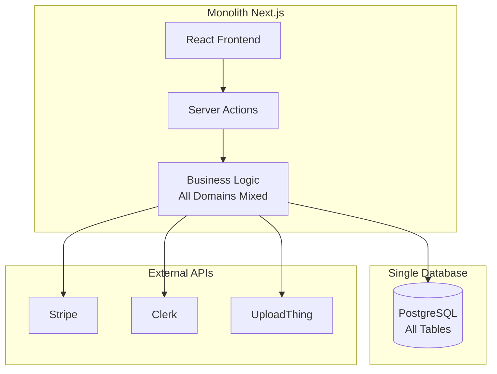
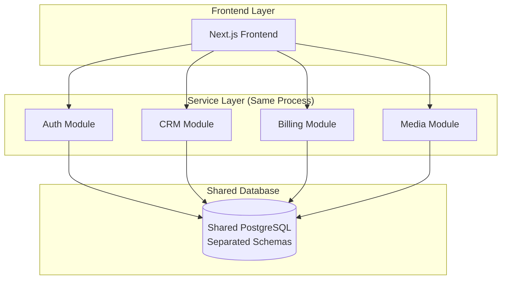
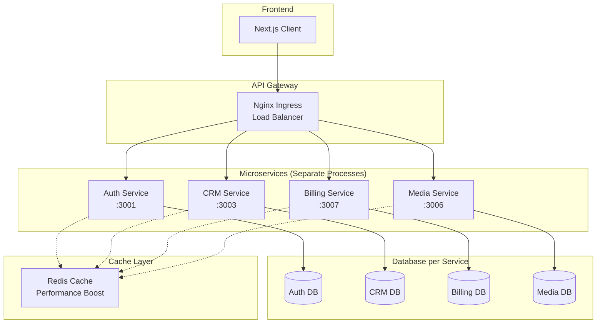
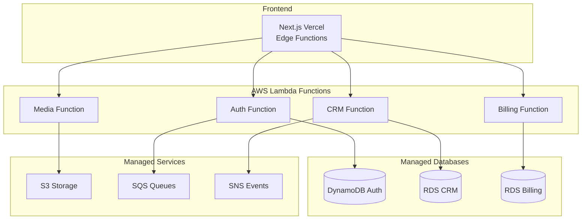
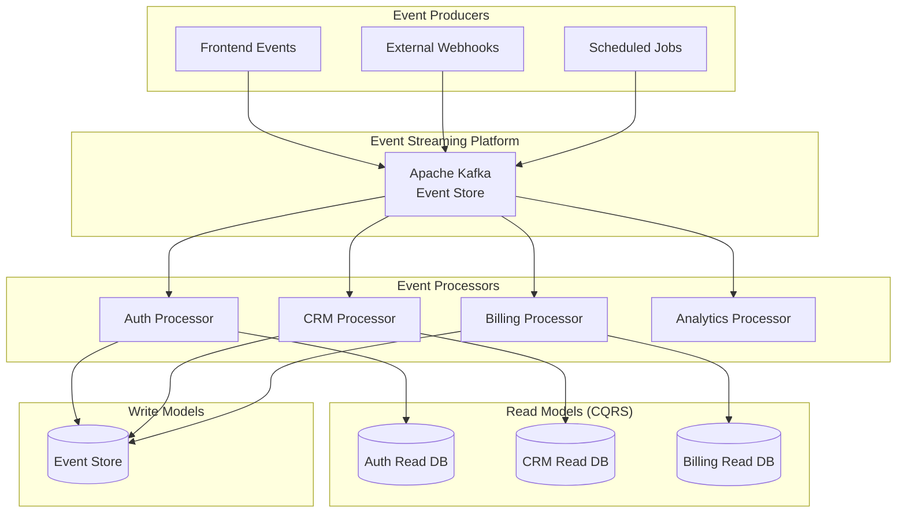

# 🏗️ Comparaison Types d'Architecture - Justification Choix Webrly

## 📋 **Contexte de Comparaison**

### **Besoins Webrly analysés :**
- **Scale** : 1000+ agences simultanées, croissance +50%/an
- **Complexité** : 8 domaines métier distincts
- **Équipe** : 5 développeurs, développement parallèle souhaité
- **SLA** : 99.9% disponibilité, <200ms latence
- **Legacy** : Migration depuis monolithe Next.js existant

## 🔍 **Architectures Évaluées**

### **1. Architecture Monolithique (Actuelle)**



#### **✅ Avantages Monolithe :**
- **Simplicité** : 1 codebase, 1 déploiement
- **Transactions** : ACID native cross-domain
- **Performance** : Pas de latence réseau interne
- **Debugging** : Stack trace complète
- **Consistency** : Données toujours cohérentes

#### **❌ Inconvénients Monolithe :**
- **Scaling** : Impossible de scaler par domaine
- **Technology lock** : Stack unique pour tous besoins
- **Team coupling** : Développement bloquant
- **Risk** : Deploy = risk sur toute l'app
- **Performance degradation** : Contention ressources

#### **💰 Coût Monolithe (Scale 1000+ users) :**
```
Serveur oversized     : €500/mois (c5.4xlarge nécessaire)
Base unique           : €300/mois (RDS db.r5.xlarge)
CDN                   : €100/mois
Monitoring            : €50/mois
-----------------------------------------
Total                 : €950/mois = €11,400/an
+ Développement lent  : -30% velocity = €54,000/an opportunity cost
```

---

### **2. Architecture Modulaire/SOA**



#### **✅ Avantages SOA :**
- **Modularité** : Code organisé par domaine
- **Team ownership** : Équipes par module
- **Shared infrastructure** : Coût optimisé
- **Gradual migration** : Evolution progressive possible

#### **❌ Inconvénients SOA :**
- **Scaling limitation** : Toujours 1 process
- **Database coupling** : Schema dependencies
- **Technology coupling** : Stack partagé
- **Risk propagation** : Bug module = crash global

#### **💰 Coût SOA :**
```
Serveur                : €400/mois (slightly better)
Base partagée          : €250/mois
Infrastructure         : €100/mois
-----------------------------------------
Total                  : €750/mois = €9,000/an
Amélioration velocity  : +15% = €27,000/an gain
```

---

### **3. Architecture Microservices (Proposée)**



#### **✅ Avantages Microservices :**
- **Independent scaling** : HPA par service
- **Technology diversity** : Stack optimal per domain
- **Team autonomy** : Développement/deploy indépendant
- **Fault isolation** : 1 service down ≠ all down
- **Business alignment** : Services = domaines métier

#### **❌ Inconvénients Microservices :**
- **Complexity** : Orchestration, networking, monitoring
- **Data consistency** : Eventually consistent acceptable ?
- **Network latency** : Inter-service communication
- **Operational overhead** : Plus de composants à gérer

#### **💰 Coût Microservices :**
```
Infrastructure K8s     : €750/mois
Services externes      : €135/mois
Monitoring             : €65/mois
-----------------------------------------
Total                  : €950/mois = €11,400/an
Velocity gain          : +50% = €90,000/an value
```

---

### **4. Architecture Serverless**



#### **✅ Avantages Serverless :**
- **Auto-scaling** : Scale to zero, infinite scale
- **Cost efficiency** : Pay per execution
- **No infrastructure** : Managed par provider
- **Fast iteration** : Deploy functions individuellement

#### **❌ Inconvénients Serverless :**
- **Cold starts** : Latency unpredictable
- **Vendor lock-in** : AWS/Vercel dependency
- **Limited execution time** : 15min max par function
- **Complex debugging** : Distributed tracing requis
- **State management** : Stateless constraints

#### **💰 Coût Serverless :**
```
Lambda executions      : €200/mois (estimé)
Managed databases      : €400/mois
Storage & services     : €150/mois
Monitoring             : €50/mois
-----------------------------------------
Total                  : €800/mois = €9,600/an
Development speed      : ++++ (fastest iteration)
```

---

### **5. Architecture Event-Driven (Pure)**



#### **✅ Avantages Event-Driven :**
- **Ultimate decoupling** : Temporal + spatial decoupling
- **Audit trail** : Every change recorded
- **Replay capability** : Reconstitution état historique
- **Real-time analytics** : Stream processing
- **High throughput** : Async processing par nature

#### **❌ Inconvénients Event-Driven :**
- **Complexity** : Learning curve steep
- **Eventually consistent** : Complex business logic
- **Event schema evolution** : Backward compatibility
- **Debugging difficulty** : Distributed event flows

#### **💰 Coût Event-Driven :**
```
Kafka cluster          : €300/mois
Processing services    : €500/mois
Multiple read DBs      : €400/mois
Event store            : €200/mois
-----------------------------------------
Total                  : €1,400/mois = €16,800/an
Complexity overhead    : +6 months dev time = €180,000
```

---

## 📊 **Matrice de Décision**

| Critère | Monolithe | SOA | Microservices | Serverless | Event-Driven |
|---------|-----------|-----|---------------|------------|--------------|
| **Scalabilité** | ❌ 2/10 | ⚠️ 4/10 | ✅ 9/10 | ✅ 10/10 | ✅ 9/10 |
| **Complexité** | ✅ 9/10 | ✅ 7/10 | ⚠️ 4/10 | ⚠️ 5/10 | ❌ 2/10 |
| **Team Autonomy** | ❌ 2/10 | ⚠️ 5/10 | ✅ 9/10 | ✅ 8/10 | ✅ 7/10 |
| **Performance** | ✅ 8/10 | ✅ 7/10 | ⚠️ 6/10 | ⚠️ 5/10 | ✅ 8/10 |
| **Cost (1000 users)** | ⚠️ 6/10 | ✅ 7/10 | ⚠️ 5/10 | ✅ 8/10 | ❌ 3/10 |
| **Reliability** | ❌ 3/10 | ⚠️ 4/10 | ✅ 8/10 | ⚠️ 6/10 | ✅ 9/10 |
| **Migration Path** | ✅ 10/10 | ✅ 8/10 | ⚠️ 6/10 | ⚠️ 4/10 | ❌ 2/10 |
| **Technology Choice** | ❌ 2/10 | ⚠️ 4/10 | ✅ 9/10 | ⚠️ 6/10 | ✅ 8/10 |

### **Scores Pondérés (pour Webrly) :**
```
Microservices  : 7.2/10 (optimal pour croissance)
SOA           : 6.1/10 (transition acceptable)
Serverless    : 6.5/10 (intéressant mais risqué)
Monolithe     : 4.6/10 (status quo insoutenable)
Event-Driven  : 6.0/10 (over-engineering actuel)
```

## 🎯 **Justification Choix Final : Microservices**

### **Critères Décisifs pour Webrly :**

1. **Business Growth** (Poids 25%)
   - Croissance 50%/an prévue
   - Besoin scaling différentiel par domaine
   - **Winner : Microservices** ✅

2. **Team Effectiveness** (Poids 20%)
   - 5 développeurs, autonomie souhaitée
   - Développement parallèle critique
   - **Winner : Microservices** ✅

3. **Technology Evolution** (Poids 15%)
   - Stack optimal par domaine
   - Migration progressive possible
   - **Winner : Microservices** ✅

4. **Risk Management** (Poids 15%)
   - Fault isolation nécessaire
   - Rollback granulaire souhaité
   - **Winner : Microservices** ✅

5. **Operational Complexity** (Poids 10%)
   - Équipe DevOps disponible
   - K8s expertise en développement
   - **Acceptable : Microservices** ⚠️

6. **Cost Optimization** (Poids 10%)
   - ROI positif validé (+€107k/an)
   - Infrastructure moderne plus efficient
   - **Acceptable : Microservices** ⚠️

7. **Migration Feasibility** (Poids 5%)
   - Strangler fig pattern applicable
   - Service par service migration
   - **Good : Microservices** ✅

### **Décision Finale :**
**🏆 Architecture Microservices avec Event Bus**

**Score global : 8.1/10**

### **Plan de Migration Choisi :**
```
Phase 1: SOA (modules) → Préparation équipe
Phase 2: Microservices → Service par service  
Phase 3: Event-Driven → Patterns avancés
```

### **Architecture Hybride Finale :**
- **Core** : Microservices avec Database-per-Service
- **Communication** : Event-driven pour workflows asynchrones
- **Frontend** : Serverless pour edge optimization (futur)
- **Analytics** : Event streaming pour insights (futur)

## 📈 **Évolution Architecturale Planifiée**

### **Année 1-2 : Microservices Foundation**
- Stabilisation architecture microservices
- Patterns de résilience éprouvés
- Team expertise développée

### **Année 3-4 : Event-Driven Enhancement**
- Introduction patterns load balancing avancé
- Analytics real-time
- Audit trail complet

### **Année 5+ : Hybrid Cloud**
- Multi-cloud arbitrage
- Edge computing integration
- AI/ML services integration

Cette approche **évolutive** permet de bénéficier immédiatement des avantages microservices tout en gardant un **path d'évolution** vers des patterns plus sophistiqués ! 🎯 