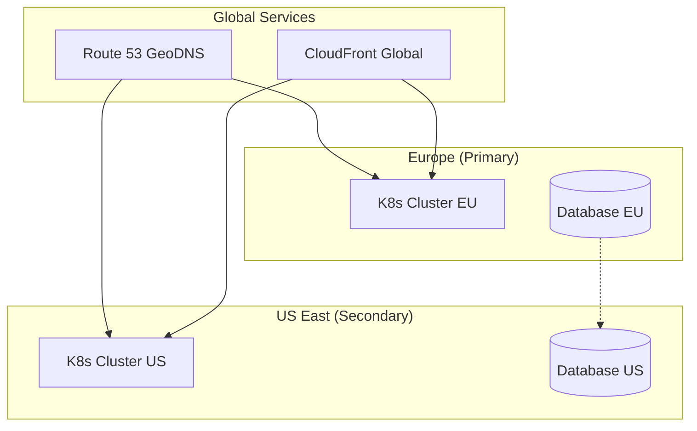
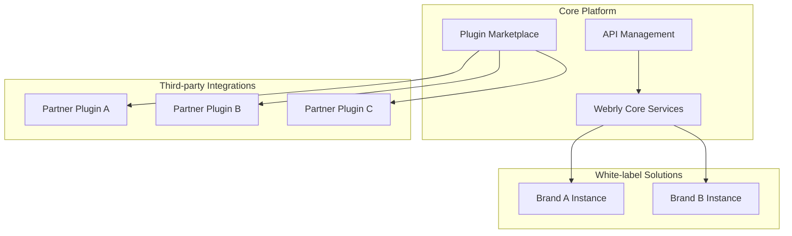

# 🗺️ Roadmap Évolution Architecture Webrly

## 📅 **Évolution Court Terme (6-12 mois)**

### **Phase 1 : Migration & Stabilisation**
**Objectif :** Passage monolithe → microservices opérationnel

**Livrables :**
- ✅ Infrastructure K8s fonctionnelle
- ✅ 8 microservices déployés  
- ✅ Event Bus Redis opérationnel
- ✅ Monitoring Prometheus/Grafana

**Évolutions techniques :**
- **Cache sophistiqué** : Redis multi-level caching
- **API versioning** : v1 → v2 avec rétrocompatibilité
- **Performance tuning** : Optimisation requêtes DB
- **Security hardening** : Scan sécurité automatisé

### **Phase 2 : Optimisation Performance**
**Objectif :** Atteindre <100ms P95 (vs <200ms actuel)

**Évolutions :**
- **Read replicas** : PostgreSQL master-slave per service
- **CDN optimisation** : Edge computing CloudFront
- **Database sharding** : Partitioning par tenant
- **Async processing** : Background jobs avec queues

**Métriques cibles :**
- **Latence P95** : <100ms (vs 200ms)
- **Throughput** : 20k req/min (vs 10k)
- **CPU utilization** : <50% moyen (vs 70%)

## 📈 **Évolution Moyen Terme (1-2 ans)**

### **Phase 3 : Expansion Géographique**
**Objectif :** Support multi-régions Europe + US

**Architecture évoluée :**


**Évolutions techniques :**
- **Multi-cluster** : K8s clusters par région
- **Data replication** : Cross-region async sync
- **Global load balancing** : GeoDNS routing
- **Compliance régionale** : GDPR EU, CCPA US

### **Phase 4 : Intelligence Artificielle**
**Objectif :** Features AI/ML pour optimisation agences

**Nouveaux services :**
- **Analytics Service** : ML insights business
- **Recommendation Engine** : AI-driven suggestions  
- **Predictive Scaling** : ML-based auto-scaling
- **Fraud Detection** : AI anti-fraud pour billing

**Stack technique :**
- **TensorFlow Serving** : ML models inference
- **Apache Kafka** : Streaming data pipeline
- **ElasticSearch** : Full-text search + analytics
- **Jupyter Hub** : Data science workspace

## 🚀 **Évolution Long Terme (2-5 ans)**

### **Phase 5 : Platformisation**
**Objectif :** Webrly devient plateforme avec marketplace

**Architecture plateforme :**


**Évolutions majeures :**
- **API Gateway avancé** : Rate limiting par tenant
- **Plugin architecture** : SDK pour partenaires
- **White-label** : Multi-branding dynamique
- **Blockchain** : Smart contracts pour revenue sharing

### **Phase 6 : Edge Computing**
**Objectif :** Latence <50ms globalement via edge

**Technologies émergentes :**
- **WebAssembly** : Logic métier à l'edge
- **5G Edge** : Déploiement edge mobile
- **Serverless Edge** : CloudFlare Workers
- **IoT Integration** : Smart devices campaign

## 🔧 **Évolutions Techniques Transverses**

### **Observabilité Avancée**
```
Année 1 : Prometheus + Grafana
Année 2 : + Jaeger (distributed tracing)
Année 3 : + AI anomaly detection
Année 4 : + Predictive monitoring
```

### **Sécurité Évolutive**
```
Année 1 : Network Policies + TLS
Année 2 : + Service Mesh (Istio)
Année 3 : + Zero Trust Network
Année 4 : + AI threat detection
```

### **Base de Données Evolution**
```
Année 1 : PostgreSQL per service
Année 2 : + Read replicas + sharding
Année 3 : + Multi-region replication
Année 4 : + Time-series DB (InfluxDB)
Année 5 : + Graph DB (Neo4j) for recommendations
```

## 📊 **Migration Patterns Évolution**

### **Strangler Fig Pattern**
```
Monolithe → Proxy → Microservices → Décommission
```
- **Graduel** : Service par service
- **Risk-free** : Rollback possible
- **Business continuity** : Zero downtime

### **Database Decomposition Pattern**
```
Single DB → Shared DB → Database per Service → Federated Data
```
- **Data consistency** : Event sourcing evolution
- **Performance** : Sharding automatique
- **Compliance** : Regional data residency

### **API Evolution Pattern**
```
REST v1 → GraphQL → Event Streams → Real-time Subscriptions
```
- **Backward compatibility** : Versioning strategy
- **Performance** : Reduced over-fetching
- **Real-time** : WebSocket upgrades

## 🎯 **Facteurs d'Évolution Decision**

### **Triggers Techniques**
- **Performance** : P95 > 200ms → Scale/optimize
- **Reliability** : SLA < 99.9% → Architecture review
- **Security** : Incident → Hardening phase
- **Cost** : >€1000/mois → Optimization pass

### **Triggers Business**
- **User growth** : +50% → Capacity planning
- **New regions** : Compliance → Multi-cluster
- **Competition** : Features gap → Innovation sprint
- **Acquisition** : M&A → Integration architecture

### **Technology Adoption Criteria**
```
1. Proven in production (>1 year market)
2. Strong community/support
3. Clear migration path
4. ROI demonstration
5. Team expertise available
```

## 📈 **Métriques Success Évolution**

### **Performance KPIs**
- **Latency P95** : 200ms → 100ms → 50ms
- **Throughput** : 10k → 50k → 100k req/min
- **Availability** : 99.9% → 99.95% → 99.99%

### **Business KPIs**  
- **Time to Market** : 6 weeks → 2 weeks → 1 week
- **Developer Velocity** : +30% → +50% → +100%
- **Infrastructure Cost/User** : Décroissant malgré features

### **Operational KPIs**
- **MTTR** : 5min → 2min → 30s
- **Deployment Frequency** : Weekly → Daily → Multiple/day
- **Change Failure Rate** : <5% → <2% → <1%

Cette roadmap démontre une **vision long terme** et une **capacité d'adaptation** continue de l'architecture ! 🗺️ 