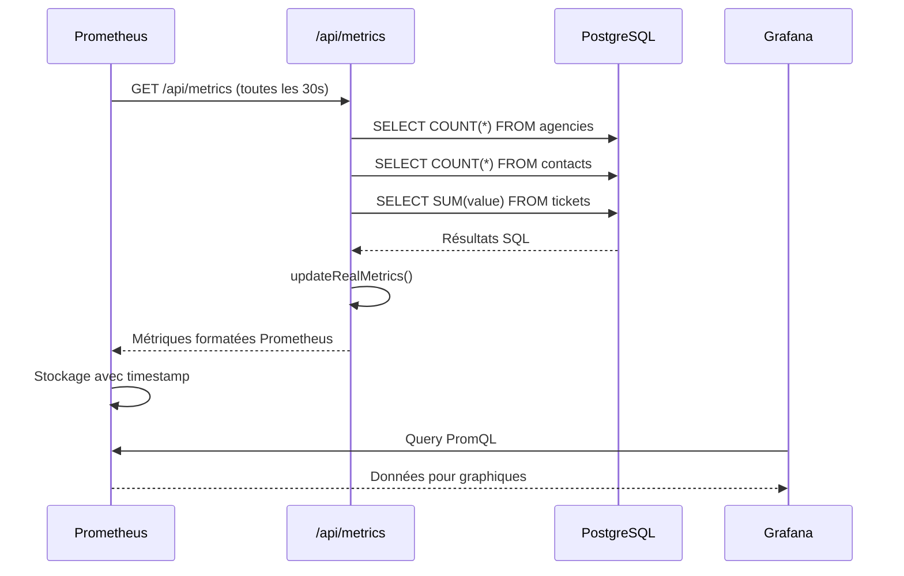

# 📊 Documentation - API Métriques Webrly

## 🎯 Vue d'ensemble

Le système de métriques de Webrly collecte automatiquement des données business en temps réel et les expose pour **Prometheus** qui les transmet ensuite à **Grafana** pour la visualisation.

## 🏗️ Architecture du flux de données

```
[Base de données PostgreSQL] 
           ↓
[API Routes Next.js] → [Prometheus Metrics]
           ↓
[Prometheus Server] → [Scraping toutes les 30s]
           ↓
[Grafana Dashboards] → [Visualisation temps réel]
```

---

## 🔌 Endpoints API

### **1. `/api/metrics` - Endpoint principal**

**URL :** `https://webrly.fr/api/metrics`  
**Méthode :** `GET`  
**Auth :** Public (pas d'authentification requise)

#### **Fonction :**
- **Utilisé par Prometheus** pour récupérer toutes les métriques
- **Scrape automatique** toutes les 30 secondes
- **Met à jour** automatiquement les données depuis la DB à chaque appel

#### **Réponse :**
```
Content-Type: text/plain; version=0.0.4; charset=utf-8

# HELP webrly_total_agencies Nombre total d'agences
# TYPE webrly_total_agencies gauge
webrly_total_agencies 5

# HELP webrly_total_contacts Nombre total de contacts
# TYPE webrly_total_contacts gauge
webrly_total_contacts 1247

# HELP nextjs_active_users Utilisateurs actifs estimés
# TYPE nextjs_active_users gauge
nextjs_active_users 12
...
```

#### **Code source :**
```typescript
// src/app/api/metrics/route.ts
export async function GET(request: NextRequest) {
  // 1. Met à jour les métriques depuis la DB
  await updateRealMetrics();
  
  // 2. Retourne les métriques au format Prometheus
  const metrics = await register.metrics();
  return new NextResponse(metrics, {
    headers: { 'Content-Type': register.contentType }
  });
}
```

---

### **2. `/api/monitoring` - Endpoint de maintenance**

**URL :** `https://webrly.fr/api/monitoring`  
**Méthode :** `GET` ou `POST`  
**Auth :** Public

#### **Fonction :**
- **Tests manuels** du système de métriques
- **Debugging** et maintenance
- **Force refresh** des données en cas de problème

#### **GET - Test simple :**
```bash
curl https://webrly.fr/api/monitoring
```

**Réponse :**
```json
{
  "status": "success",
  "message": "Métriques business mises à jour avec succès",
  "timestamp": "2025-06-13T19:15:30.123Z",
  "endpoint": "/api/monitoring"
}
```

#### **POST - Force refresh :**
```bash
curl -X POST https://webrly.fr/api/monitoring
```

---

## 📈 Métriques collectées

### **🏢 Métriques Business CRM**

| Métrique | Description | Type | Source DB |
|----------|-------------|------|-----------|
| `webrly_total_agencies` | Nombre d'agences | Gauge | `db.agency.count()` |
| `webrly_total_subaccounts` | Sous-comptes créés | Gauge | `db.subAccount.count()` |
| `webrly_total_contacts` | Contacts dans le CRM | Gauge | `db.contact.count()` |
| `webrly_total_tickets` | Tickets de support/vente | Gauge | `db.ticket.count()` |
| `webrly_total_ticket_value` | Valeur totale des tickets (€) | Gauge | `SUM(ticket.value)` |
| `webrly_total_funnels` | Funnels de vente créés | Gauge | `db.funnel.count()` |
| `webrly_published_funnels` | Funnels publiés | Gauge | `COUNT(funnel WHERE published=true)` |
| `webrly_total_funnel_visits` | Visites sur les funnels | Gauge | `SUM(funnelPage.visits)` |
| `webrly_active_subscriptions` | Abonnements payants actifs | Gauge | `COUNT(subscription WHERE active=true)` |

### **📅 Métriques Quotidiennes**

| Métrique | Description | Type | Calcul |
|----------|-------------|------|--------|
| `webrly_new_users_today` | Nouveaux utilisateurs aujourd'hui | Gauge | `COUNT(user WHERE createdAt >= today)` |
| `webrly_new_contacts_today` | Nouveaux contacts aujourd'hui | Gauge | `COUNT(contact WHERE createdAt >= today)` |
| `webrly_tickets_created_today` | Tickets créés aujourd'hui | Gauge | `COUNT(ticket WHERE createdAt >= today)` |

### **👥 Métriques Utilisateurs**

| Métrique | Description | Type | Calcul |
|----------|-------------|------|--------|
| `nextjs_active_users` | Utilisateurs actifs estimés | Gauge | `newUsers × 3 + agencies × 1.5` |
| `nextjs_auth_attempts_total` | Tentatives d'authentification | Counter | Labels: `{status, provider}` |

### **🖥️ Métriques Système (automatiques)**

| Métrique | Description | Type | Source |
|----------|-------------|------|--------|
| `nextjs_process_cpu_seconds_total` | CPU utilisé par Node.js | Counter | prom-client |
| `nextjs_process_resident_memory_bytes` | Mémoire utilisée | Gauge | prom-client |
| `nextjs_nodejs_heap_size_used_bytes` | Heap JavaScript | Gauge | prom-client |

---

## ⚙️ Configuration Prometheus

### **Fichier de configuration :**
```yaml
# monitoring/prometheus/prometheus.yml

scrape_configs:
  - job_name: 'nextjs-app'
    static_configs:
      - targets: ['webrly.fr']
    metrics_path: '/api/metrics'
    scheme: https
    scrape_interval: 30s
```

### **Pourquoi ça fonctionne :**

1. **Prometheus** envoie une requête `GET` vers `https://webrly.fr/api/metrics` toutes les 30 secondes
2. **Notre API** exécute `updateRealMetrics()` qui fait des requêtes SQL vers PostgreSQL
3. **Les métriques** sont mises en cache dans le registre `prom-client`
4. **La réponse** est formatée selon le standard Prometheus (text/plain)
5. **Prometheus** stocke ces données avec un timestamp
6. **Grafana** interroge Prometheus pour afficher les graphiques

---

## 🔄 Cycle de mise à jour

### **Timing :**
- **Prometheus scrape** : Toutes les 30 secondes
- **Mise à jour DB** : À chaque scrape (30s)
- **Rafraîchissement Grafana** : 30 secondes (configurable)

### **Flux détaillé :**



---

## 🐛 Debugging et maintenance

### **Tests manuels :**

```bash
# Tester l'endpoint principal
curl https://webrly.fr/api/metrics | head -20

# Forcer une mise à jour
curl https://webrly.fr/api/monitoring

# Vérifier une métrique spécifique
curl https://webrly.fr/api/metrics | grep "webrly_total_agencies"
```

### **Vérifier dans Prometheus :**

1. Aller sur `http://134.122.66.187:9090`
2. **Status → Targets** → Vérifier que `nextjs-app` est "UP"
3. **Graph** → Taper `webrly_total_agencies` → Execute

### **Logs de debugging :**

```bash
# Dans les logs de l'application Next.js
✅ Métriques réelles mises à jour: {
  agencies: 5,
  subAccounts: 12,
  contacts: 1247,
  tickets: 89,
  ticketValue: 15600,
  activeUsers: 18
}
```

### **Problèmes courants :**

| Problème | Cause | Solution |
|----------|-------|----------|
| Métriques à 0 | Erreur DB ou Prisma | Vérifier logs Next.js |
| Pas de données dans Grafana | Prometheus ne scrape pas | Vérifier Status → Targets |
| Métriques obsolètes | Cache ou délai | Appeler `/api/monitoring` |

---

## 📊 Utilisation dans Grafana

### **Requêtes PromQL utiles :**

```promql
# Nombre d'agences
webrly_total_agencies

# Croissance des contacts
rate(webrly_total_contacts[1h]) * 3600

# Valeur moyenne par ticket
webrly_total_ticket_value / webrly_total_tickets

# Taux de conversion funnel
webrly_published_funnels / webrly_total_funnels * 100

# Activité quotidienne
sum(webrly_new_users_today + webrly_new_contacts_today + webrly_tickets_created_today)
```

### **Dashboards disponibles :**

1. **📊 Webrly - Business Metrics (Real Data)** → Métriques business principales
2. **🚀 Deployment & Performance Monitoring** → Surveillance serveur
3. **Node Exporter Full** → Métriques système détaillées

---

## 🔧 Code source principal

### **Fichiers importants :**

- `src/app/api/metrics/route.ts` → Endpoint principal Prometheus
- `src/app/api/monitoring/route.ts` → Endpoint de maintenance
- `src/lib/real-metrics.ts` → Logique de collecte des métriques
- `src/lib/metrics.ts` → Configuration prom-client
- `monitoring/prometheus/prometheus.yml` → Config Prometheus

### **Fonction clé :**

```typescript
// src/lib/real-metrics.ts
export async function updateRealMetrics() {
  // Requêtes SQL parallèles pour optimiser la performance
  const [agenciesCount, contactsCount, ticketsCount] = await Promise.all([
    db.agency.count(),
    db.contact.count(), 
    db.ticket.count()
  ]);
  
  // Mise à jour des métriques Prometheus
  totalAgencies.set(agenciesCount);
  totalContacts.set(contactsCount);
  totalTickets.set(ticketsCount);
}
```

---

## 🚀 Évolutions possibles

### **Métriques avancées :**
- Métriques par agence (avec labels)
- Taux de conversion détaillés
- Performance des funnels individuels
- Métriques de rétention utilisateurs

### **Optimisations :**
- Cache Redis pour éviter trop de requêtes DB
- Métriques calculées en arrière-plan
- Alerting avancé sur les métriques business

---

*Cette documentation couvre l'ensemble du système de métriques Webrly. Pour toute question, vérifiez d'abord les logs et les endpoints de test.* 🔍 